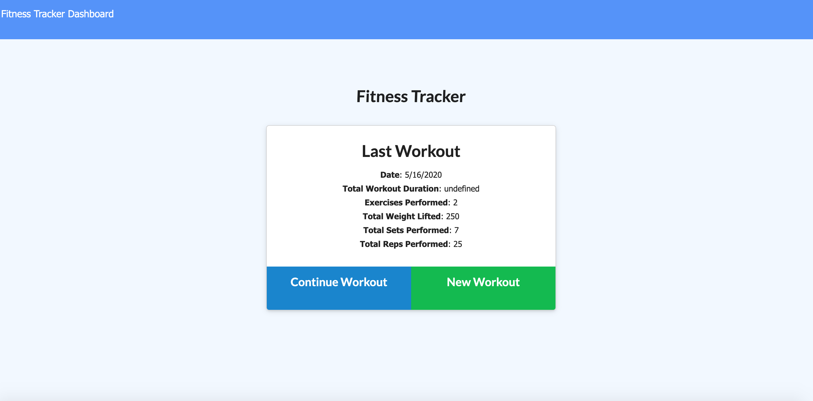

# FitnessTracker

The objective of this assingment was to create a responsive application called "Fitness Tracker" which would allow the user to 
track their workouts. The user is able to add to a current workout in order to have their weights, reps, and sets added together. They are also able to add new workouts as a completely separate session. 

This application utilized MongoDB as it's database and was launched with Heroku. 

This assignment used Mongoose, MongoDB, and manipulating a database using a front end application. It was challenging working
with the front end provided, however, I am proud of the functionality I was able to create with my back end work. 

Here is a link to the deployed application on Heroku: 

https://rocky-atoll-24354.herokuapp.com

Here is a link to the GitHub repository: 
https://github.com/laurendoss/FitnessTracker

And finally, here is a screenshot of the deployed app: 
